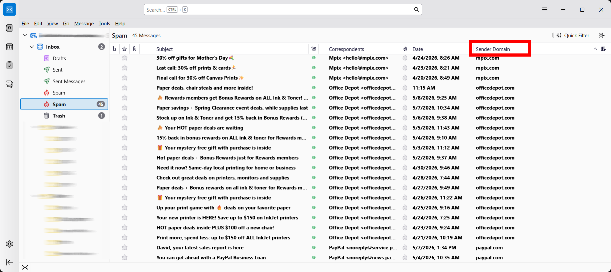

# Sender Domain Column for Thunderbird

Adds a **Sender Domain** column to Thunderbird's message list showing the apex domain of each sender's email address — subdomains are automatically collapsed.

| Sender address | Column shows |
|---|---|
| `info@abc.com` | `abc.com` |
| `admin@help.xyz.com` | `xyz.com` |
| `noreply@mail.bbc.co.uk` | `bbc.co.uk` |

Useful for quickly spotting which company or service an email comes from, and for sorting/grouping messages by sender domain.



## Requirements

- Thunderbird 115 or newer

## Installation

1. Download `sender-domain-column.xpi` from the [Releases](../../releases) page (or build it yourself — see below).
2. In Thunderbird, open the menu and go to **Add-ons and Themes**.
3. Click the gear icon ⚙ and choose **Install Add-on From File**.
4. Select the `.xpi` file and click **Add**.

## Enabling the column

After installing, the column is hidden by default. To show it:

1. Right-click anywhere on the **column header bar** in your message list.
2. Tick **Sender Domain** in the menu.

You can drag it to reorder it, and click the header to sort by domain.

## Building from source

Requires Windows with PowerShell (no extra tools needed).

```bat
git clone <this repo>
cd ThunderbirdDomainColumn
build.bat
```

This produces `sender-domain-column.xpi` in the project root, which you can install as described above.

## How subdomain collapsing works

The extension keeps only the **apex domain** — the registered part of the hostname:

- Simple domains (`abc.com`, `example.org`) are kept as-is.
- Subdomains (`mail.`, `help.`, `cdn.`) are stripped.
- Country-code second-level domains (`co.uk`, `com.au`, `gov.uk`, etc.) are detected and preserved with their parent label, so `mail.bbc.co.uk` becomes `bbc.co.uk` rather than just `co.uk`.

## License

MIT
